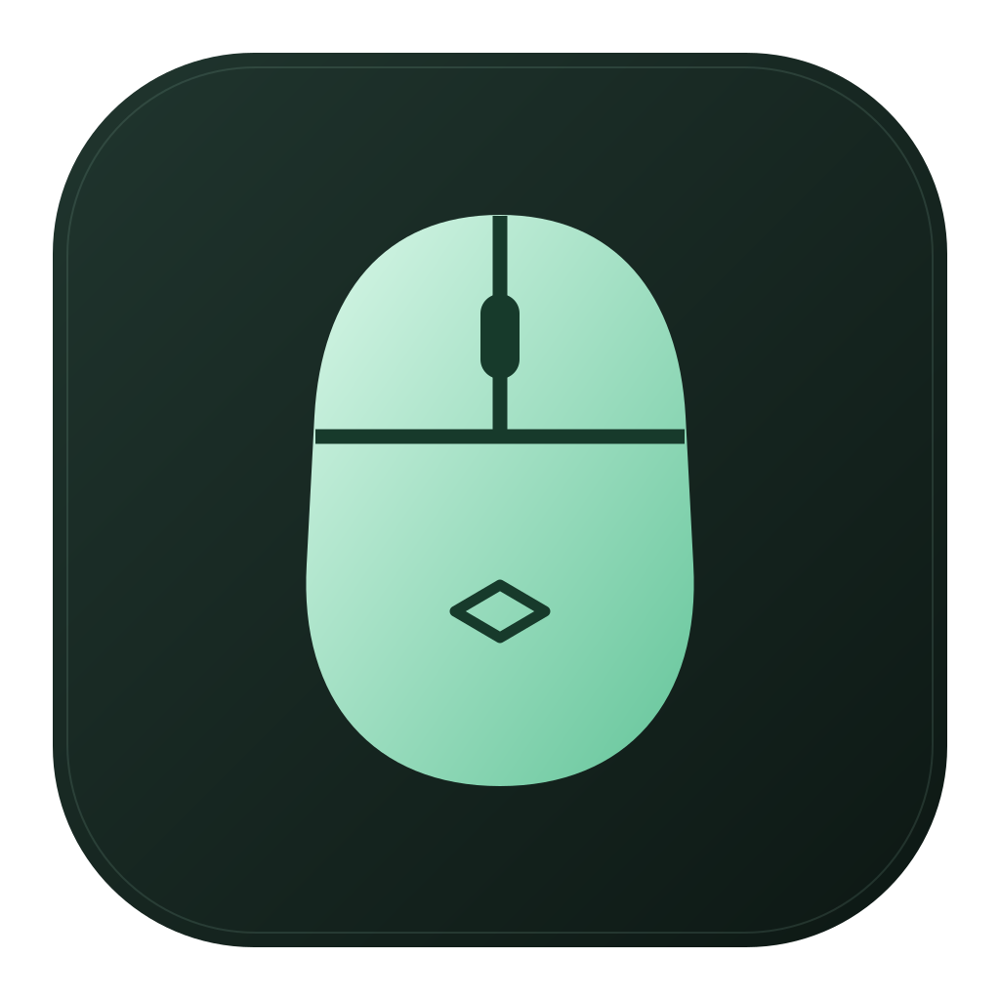
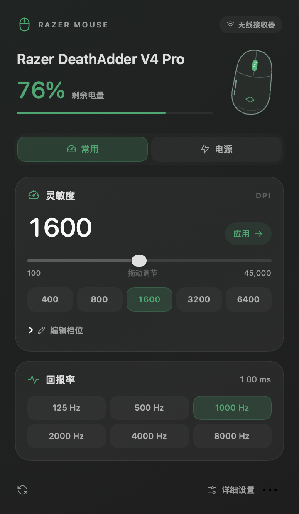
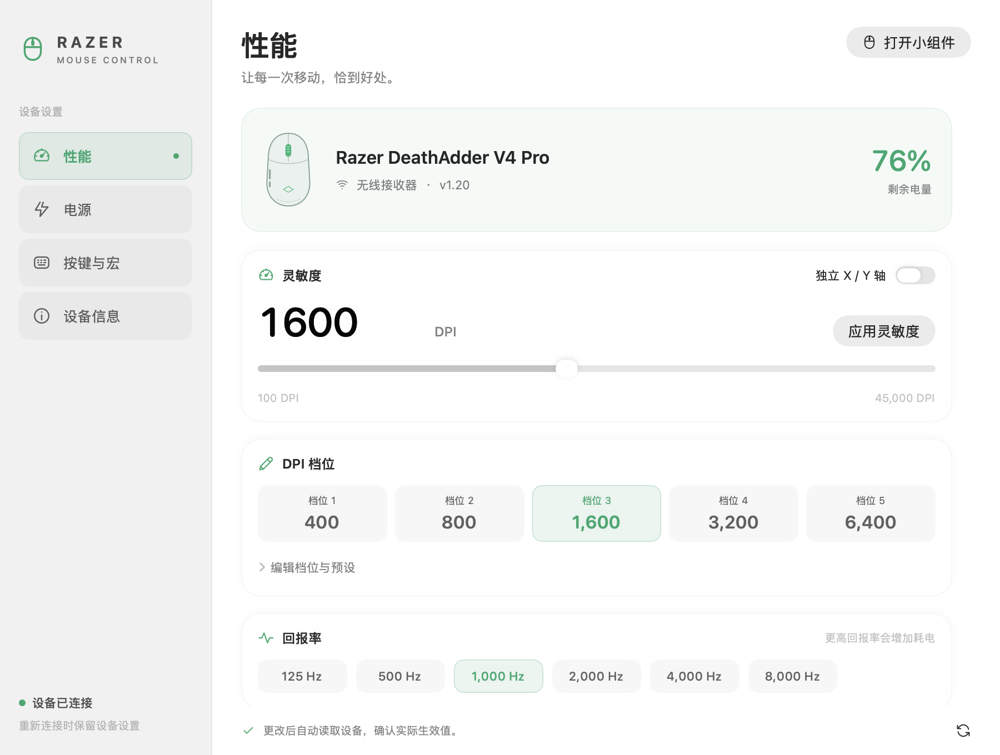

<div align="center">
  
  <h1>RazerMouse</h1>
  <p>在 macOS 菜单栏里，直接调节你的雷蛇鼠标。</p>
  <p>SwiftUI · Rust · UniFFI · macOS 14+ · Apple Silicon</p>
  <p><a href="README.md">English</a> · <b>简体中文</b></p>
</div>

调节 DPI、回报率、电源与设备支持的灯光，无需离开当前工作。SwiftUI 通过 UniFFI ABI 直接调用静态链接的 Rust 核心，不包含产品 CLI、WebView 或独立后台服务。

**当前处于早期开发阶段。** DeathAdder V4 Pro 的有线和无线链路已有部分实机验收；其他型号的协议对照通过不等于实机通过。界面目前为中文。本项目独立开发，非雷蛇官方产品。

## 界面

<table>
  <tr>
    <td width="34%"></td>
    <td></td>
  </tr>
  <tr><td align="center">菜单栏直接操作</td><td align="center">完整设置窗口</td></tr>
</table>

以上截图由实际 SwiftUI 视图和**模拟设备数据**渲染，用于展示视觉效果，不代表硬件验收。

## 可以做什么

- **性能调节**：填写 DPI、选择和编辑档位、调整回报率，范围由设备能力决定。
- **电源管理**：电量、充电状态、休眠等待、低电量阈值；断开后明确标记上次读数。
- **灯光控制**：按能力展示灯区、效果、颜色、亮度和自定义灯光帧；可将本次效果同步到选中的其他兼容设备。
- **滚轮与宏**：设备支持的硬件滚轮设置；本机倾斜动作、键盘宏录制、鼠标触发键识别及绑定保存。软件动作默认关闭，保留原生输入。
- **设备信息**：连接方式、固件、序列号和支持能力。
- **原生界面**：SVG 图标、系统语义颜色、深浅色、可访问性标签与降低动态效果支持；AppKit 不透明弹窗承载 SwiftUI 面板。

仅显示当前设备支持的控制。重新连接时读取硬件，不自动套用预设。检测到雷云时提示控制冲突，不自动结束进程。

## 下载

证书签名的 Apple Silicon 安装包发布在 [GitHub Releases](https://github.com/JamesLinYJ/RazerMouse/releases)。安装前请查看对应版本的签名报告和公证状态。下方源码构建默认使用 ad-hoc 签名；Developer ID 打包方法见 [发布说明](docs/RELEASING.md)。

## 构建与运行

需要 Apple Silicon Mac、macOS 14 或更高版本、带 Swift 5.9+ 工具链及 macOS SDK 的 Xcode、Rust/Cargo、Python 3 和 Git。开发时验证使用 Rust 1.98 与 Swift 6.4 beta；并未覆盖所有工具链组合。

```sh
git clone https://github.com/JamesLinYJ/RazerMouse.git
cd RazerMouse
./scripts/build.sh
```

产物为 `build/RazerMouse.app`，复制到应用程序目录后打开。统一构建会生成 Swift ABI 绑定、编译资源，并使用中立标识 `org.razermouse.app` 进行本地签名。当前为 **ad-hoc 签名开发版本**，尚非经公证的正式发行包。

如果 Xcode 位于自定义目录，构建前将 `DEVELOPER_DIR` 指向其 `Contents/Developer`，不要把本机绝对路径写入项目。

### 权限

访问 HID 可能需要在“系统设置 → 隐私与安全 → 输入监控”中允许本应用；遇到拒绝时，应用会显示入口。ad-hoc 签名改变后，系统可能要求刷新授权条目并重启应用。

宏和倾斜动作的合成输入需要单独的**辅助功能权限**。键盘录制只发生在获得焦点的录制视图中。绑定和预设保存在本机，应用不会上传设备序列号。

## 测试

```sh
./scripts/test.sh
```

默认测试不操作真实硬件，包含参数与状态测试，以及输出到 `build/screenshots/` 的 40 张视觉状态截图。公开测试集包含 6 项 Rust、11 项 Swift 测试；依赖外部样本的对照测试和 2 项硬件测试默认跳过。开发期间曾通过 5,854 条上游独立样本对照，该样本集不随公开仓库发布。

明确启用连接设备的**只读测试**：

```sh
RAZER_HARDWARE_READ=1 ./scripts/test.sh
```

协议参考固定为 OpenRazer `6820f9da169d354bc7e6e93a0aa8683a6bb75792`。仓库保留运行必需的设备目录、参数范围和报文数据，**不包含上游源码 checkout、参考样本或协议提取／重写脚本**。普通构建和测试无需下载或编译 OpenRazer；UniFFI 绑定生成仍属于正常编译步骤。

## 架构

| 位置 | 职责 |
| --- | --- |
| `crates/razer-core/src/protocol.rs`、`wire.rs`、`engine.rs` | 类型化协议、报文、响应校验与传输契约 |
| `crates/razer-core/src/backend.rs` | 常驻 OS 线程上的非独占 HID/USB 通信 |
| `crates/razer-core/src/controller.rs` | UniFFI ABI、能力、类型化设置及回读 |
| `app/Sources/RazerMouse/Model.swift` | 异步状态、刷新、已确认值和操作反馈 |
| `app/Sources/RazerMouse/StatusPopover.swift` | 原生菜单栏入口、不透明弹窗与尺寸管理 |
| `app/Sources/RazerMouse/InputActions.swift` | macOS 输入监听及可取消的本机动作 |
| `scripts/`、`tools/bindgen/` | 应用构建、ABI 绑定生成、图标打包与验证 |

IOKit 插拔通知触发刷新，5 秒设备枚举作为兜底；电量每 60 秒刷新，启动和打开面板时也会刷新。HID 句柄始终归同一个 OS 线程管理，单纯使用串行队列不能保证 macOS RunLoop 的线程生命周期。

## 实际验收范围

| 项目 | 当前证据 |
| --- | --- |
| 协议目录 | 113 个鼠标/接收器 PID，5,854 条独立对照样本 |
| V4 Pro 有线 | 读取、主窗口设置写入与回读已验证 |
| V4 Pro 无线 | 单次读取，小组件 DPI、档位、回报率和休眠写入/回读已验证并恢复 |
| 原生弹窗 | 已实际检查连接状态、电源、展开档位、非法输入恢复及关闭再打开 |
| 其他设备 | 缺少硬件验证；一次无线连续读取测试曾超时 |
| 宏输出、倾斜、多设备灯光 | 已有软件测试与界面，实际输出仍需权限或对应硬件 |
| 拔插延迟、睡眠唤醒、重启 | 尚未完成全流程实机验收 |

每型号矩阵及历史性能记录见 [覆盖报告](docs/coverage.md)。最新安装包约 6.04 MB；尚未重新测量这一版本的空闲 CPU 和内存，不将此前测量值视为新版结果。

## 贡献与许可证

修改前请阅读 [AGENTS.md](AGENTS.md) 中的架构和验证约束；界面约定见 [设计说明](design/README.md)。

项目采用 **[GPL-2.0-or-later](LICENSE)**。协议依据和生成数据来自 [OpenRazer](https://github.com/openrazer/openrazer)，保留上游及依赖的许可和归属说明。详见 [许可证与来源](docs/LICENSING.md) 和 [第三方声明](THIRD_PARTY_NOTICES.md)。
